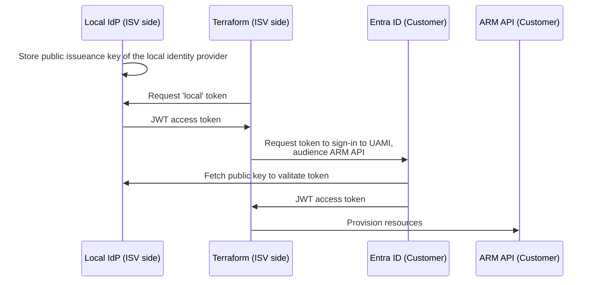

# Demo

[](https://portal.azure.com/#create/Microsoft.Template/uri/https%3A%2F%2Fraw.githubusercontent.com%2Fchgeuer%2Fisv_federated_cross_tenant_access%2Fmain%2Fsetup%2Fmain.json)

> This sample repo demonstrates how a customer can grant an ISV access to the customer's Azure environment, such as the root management group (which contains all Azure subscriptions).

Usually, Microsoft Entra recommends the use of "multi-tenant applications" for cross-tenant resource access. However, installing another tenant's multi-tenant app in the customer tenant requires administrative privileges in the customer's Entra ID tenant. This sample demonstrates how to achieve a similar goal exclusively in the ARM control plane. 

## Demo scenario

The end-to-end process of this demo works like this:

1. An Azure administrator on the customer side deploys an ARM template from this repo (by clicking the "Deploy to Azure" button above, or following [this link](ttps://portal.azure.com/#create/Microsoft.Template/uri/https%3A%2F%2Fraw.githubusercontent.com%2Fchgeuer%2Fisv_federated_cross_tenant_access%2Fmain%2Fsetup%2Fmain.json)). This template does a couple of things: 
   1. It creates a new resource group in one of the customer's Azure subscriptions.
   2. In that resource group, it creates a user-assigned managed identity (UAMI).
   3. It configures a federated identity credential for that UAMI. This federated credential allows the ISV to leverage [workload-identity federation](https://learn.microsoft.com/en-us/entra/workload-id/workload-identity-federation) to remotely sign-in to that UAMI.
   4. It adds a resource lock to the UAMI, to prevent accidental deletion on the customer side.
   5. It grants the UAMI Owner permissions at the tenant root management group, i.e. on all Azure subscriptions on the customer side. **This is a very broad permission. The template can of course be tweaked to provide fewer permissions, or the RBAC assignment can be completely be removed, so that the customer makes their own more fine-grained RBAC assignment**.
2. Once the UAMI exists on customer side, with properly configured federated identity credential, and RBAC assignment, the ISV can remotely sign-in to the UAMI, using the ISV's own identity provider (IdP). So the ISV fetches an access token from the local IdP, to use that to sign-in to the UAMI, and then use the UAMI's access token.
3. In the concrete sample, we want to use Terraform on the ISV side, to deploy resources into the customer environment. For that to work, Terraform needs to either dynamically fetch an access token for the UAMI from the local IdP, or access a local file which already contains that access token.

## Terraform

### Configure Terraform to call into a custom IdP for federated sign-in

Terraform can be configured to do an OIDC flow, to obtain a token to sign-in to the UAMI on the customer side.

> Please check the official Hashicorp docs ([Azure Provider: Authenticating using a Service Principal with Open ID Connect](https://registry.terraform.io/providers/hashicorp/azurerm/latest/docs/guides/service_principal_oidc)). Despite the document's title saying "authenticating using a Service Principal", this capability isn't limited to regular service principals, but works in exactly the same way for a user-assigned managed identity (which is a service principal under the hood).

For this scenario, the ISV can set `use_oidc = true`, and supply an `oidc_request_url` and an `oidc_request_token`. Terraform issues a token issuance `GET` request to the OIDC request URL, with an audience of `api://AzureADTokenExchange`, and sets the `Authorization: Bearer ...` HTTP header with the supplied `oidc_request_token`.




In the Terraform configuration, the ISV can specify the parameters of the customer environment (`tenant_id`, `client_id` and `subscription_id`), as well as the local IdP configuration (`oidc_request_url` and `oidc_request_token`).

```terraform
terraform {
  required_providers {
    azurerm = {
      source  = "hashicorp/azurerm"
      version = "=3.77.0"
    }
  }
}

provider "azurerm" {
  # The id of the customer's Entra ID tenant
  tenant_id          = "customertenant.onmicrosoft.com"
  # The subscription_id of the customer
  subscription_id    = "724467b5-..."

  use_oidc           = true
  # The client_id of the customer-side user-assigned managed identity to sign-in to
  client_id          = "8159cab2-06f2-4098-9fbd-uami-client-side"

  # A local URL of the ISV's own identity provider
  oidc_request_url   = "https://idp.isv.com/issue"
  # A token which will be passed in to the ISV's own identity provider
  oidc_request_token = "secret"
  features {
  }
}
```

Once the ISV runs `terraform apply`, the ISV's IdP will receive this request:

```http
GET /issue?audience=api%3A%2F%2FAzureADTokenExchange HTTP/1.1
Host: idp.isv.com
Authorization: Bearer secret
Content-Type: application/x-www-form-urlencoded
Accept: application/json
Accept-Encoding: gzip

```

#### Simulate web server to see Terraform's request

```shell
cd /home/chgeuer/.lego/certificates/
cat hp.geuer-pollmann.de.key hp.geuer-pollmann.de.crt > hp.geuer-pollmann.de.pem
socat openssl-listen:3000,reuseaddr,cert=/home/chgeuer/.lego/certificates/hp.geuer-pollmann.de.pem,verify=0,fork stdio
curl --include https://hp.geuer-pollmann.de:3000/
```

## Terraform local token


